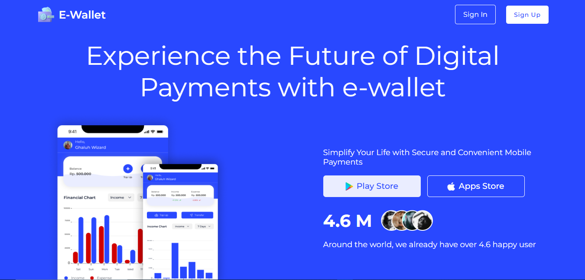

# E-Wallet Slicing

## Project Description

In this project, I worked on slicing 16 pages of a 16 page E-Wallet Website figma design, along with its responsiveness. Using only HTML and Vanilla CSS

## Preview



## How To Run This Project

Clone this project url :

``` https://github.com/VsalCode/fgo24-css-slicing.git ```

after entering the folder, install the dependencies:

```npm install```

To run the web you can use the command :

```npm run dev```

##  dependencies used
- Live Server


## How To Contribute

Pull requests are welcome. For major changes, please open an issue first. to discuss what you would like to change.

Please make sure to update tests as appropriate.

## License

[ISC](https://opensource.org/license/isc-license-txt)

